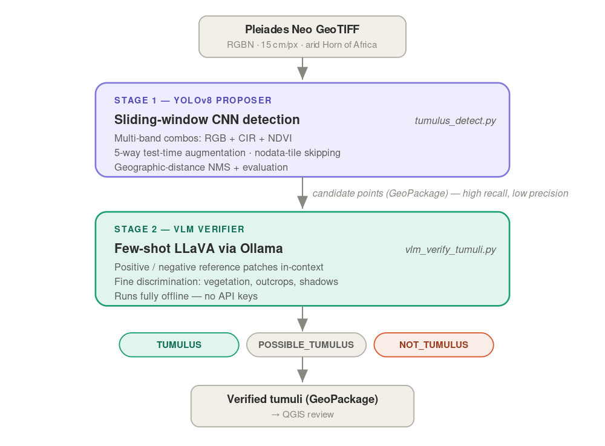
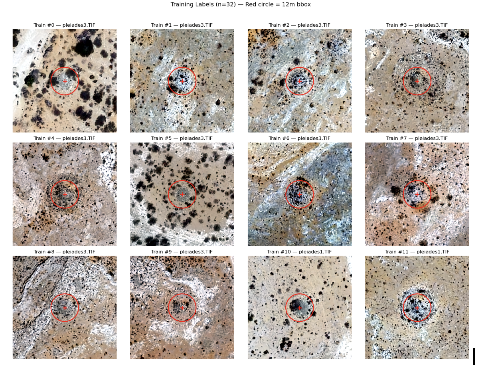
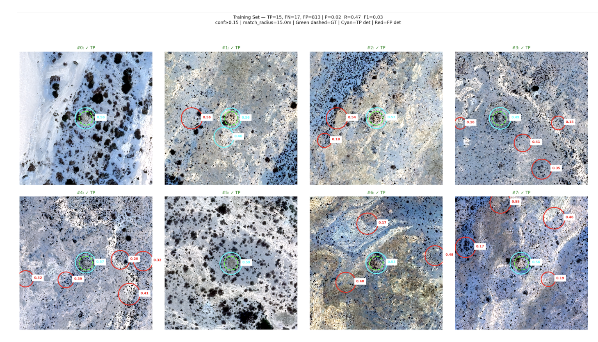

# Tumulus Detection — Somalia (Pleiades Neo)

Detecting ancient stone tumuli (burial cairns) from very-high-resolution
satellite imagery (Pleiades Neo HD, 15 cm/px) over arid landscapes in the
Horn of Africa.

## Approach

A **two-stage pipeline**: a high-recall CNN proposer followed by a
vision-language-model verifier. Ground-truth labels are scarce, so the design
casts a wide net with YOLO and culls false positives with a VLM.




*Stage 1 (YOLOv8) proposes candidate points at high recall; Stage 2 (LLaVA via
Ollama) verifies each candidate as TUMULUS / POSSIBLE_TUMULUS / NOT_TUMULUS.*

### Stage 1 — YOLOv8 detection
- Trained on 32 confirmed tumulus points plus hard negatives (see
  `tumulus_yolo_v3.ipynb`).
- At inference, each tile is run through three band combinations (RGB, CIR,
  NDVI) and detections are merged before non-max suppression.
- Pleiades Neo bands are **RGBN** (Red=0, Green=1, Blue=2, NIR=3); training and
  inference must use this order consistently.
- Output: detections as GeoPackage, plus precision/recall/F1 sweeps.

The training labels are point geometries; each is expanded to a fixed ~12 m
bounding box (roughly one tumulus diameter) for detector training.




### Stage 2 — VLM verification
- Each YOLO candidate patch is shown to a local vision LLM (LLaVA via Ollama)
  with a few-shot prompt of confirmed tumuli and background examples.
- The VLM does the fine discrimination YOLO can't (vegetation, rock outcrops,
  shadows), turning a noisy candidate list into a clean one.
- Runs fully offline — no API keys required.

## Data

- **Imagery:** Pléiades Neo 4 (Airbus Defence and Space), 4-band RGBN,
  High-Definition 0.15 m/px. The scene used here was acquired on 15 March 2025.
- **Study area:** northern Somalia, semi-arid to arid Horn of Africa.
- **Labels:** 32 visually confirmed tumulus points, plus curated background
  (hard-negative) points marking known false positives (outcrops, vegetation,
  drainage features, stone piles).

> **Note:** satellite imagery, model weights, and tumulus coordinates are not
> included in this repo — the imagery is licensed (Airbus) and site locations
> are withheld to reduce looting risk.

## Preliminary results

Results are **qualitative and preliminary**. On the (small) labelled set the
proposer recovers a substantial fraction of known sites while, by design,
producing many false positives that Stage 2 then filters. The figure below
shows a Stage-1 sweep evaluated against ground truth.




*Green dashed = ground truth · cyan = matched detection (TP) · red = false
positive. Example run: TP=15, FN=17, FP=813, P≈0.02, R≈0.47, F1≈0.03
(conf ≥ 0.15, match radius 15 m).*

> These numbers are **illustrative, not a benchmark.** They are computed on a
> very small label set, so a single match shifts recall substantially, and the
> low precision reflects the intentionally high-recall proposer — the false
> positives are what Stage 2 is built to remove. The VLM verifier's own
> accuracy has not yet been quantified against an independent test set.
> Expanding and diversifying the confirmed-site corpus is the clearest path to
> meaningful evaluation.

## Repository layout

```
tumulus_detect.py        Stage 1 — YOLO sliding-window inference + evaluation
vlm_verify_tumuli.py     Stage 2 — VLM verification pipeline
create_patches.ipynb     Patch extraction helper
tumulus_yolo_v3.ipynb    Training notebook (Colab)
setup_vlm.sh             Ollama + vision-model setup
environment/             Conda + Poetry environment specs
docs/figures/            README figures
CHANGES.md               Version history
```

## Setup

Conda:
```bash
conda env create -f environment/environment.yml
conda activate tumulus
```

or Poetry:
```bash
cd environment && poetry install
```

For Stage 2, install Ollama and a vision model:
```bash
bash setup_vlm.sh
```

## Usage

Stage 1 — run detection (configure paths at the top of the file):
```bash
python tumulus_detect.py
```

Stage 2 — verify candidates:
```bash
python vlm_verify_tumuli.py \
    --detections ./output/detections/tumulus_detections.gpkg \
    --image ./data/pleiades1.TIF ./data/pleiades3.TIF \
    --labels ./data/tombs_training.gpkg \
    --backgrounds ./output/detections/backgrounds.gpkg \
    --output ./output/detections/verified.gpkg \
    --model llava
```
